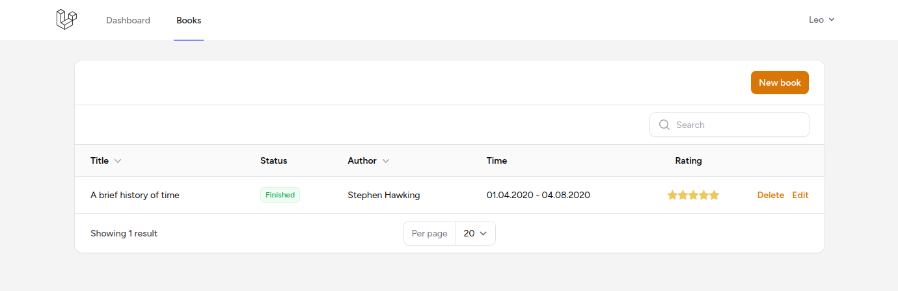
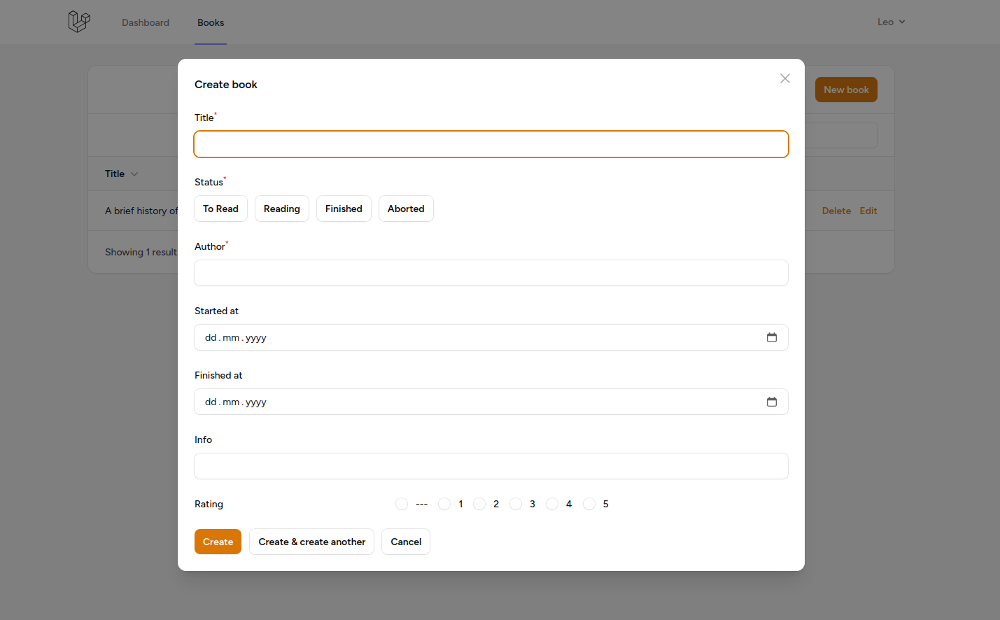

# Books

A simple browser-based application to track your books and their reading statuses.

## Installation

-   requires php 8.4 and nodejs
-   navigate to project directory
-   run `npm install` and `composer install` to install dependencies
-   copy `.env.example` to `.env` and optionally change variables
-   run `php artisan migrate` to create database
-   run `php artisan key:generate` to generate encryption key

# Starting

-   to start the frontend, run `npm run dev`
-   and for the backend, run `php artisan serve`
